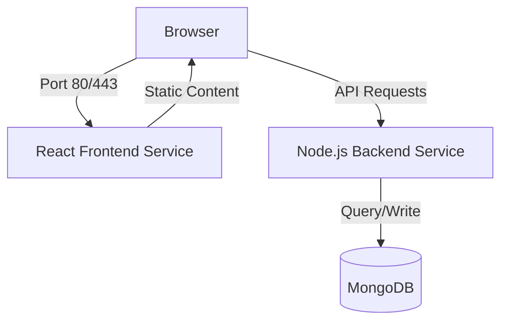

# Cloud Architecture: Helm (The Package Manager for Kubernetes)

### 1. Overview
Helm is often referred to as the "package manager for Kubernetes." Just as `npm` or `apt` manage software packages for operating systems, Helm manages **Charts**, which are pre-configured Kubernetes resources. For senior engineers, Helm is the tool used to standardize deployments across environments and manage the complexity of hundreds of YAML files.

### 2. Key Concepts
*   **Charts**: A collection of files that describe a related set of Kubernetes resources (Deployments, Services, Ingress, etc.).
*   **Templates**: YAML files with placeholders (e.g., `{{ .Values.replicaCount }}`) that are rendered into valid Kubernetes manifests by the Helm engine.
*   **Values**: The configuration data that fills in the templates. Usually stored in a `values.yaml` file or passed via `--set`.
*   **Releases**: A specific instance of a chart running in a cluster. You can have multiple "releases" of the same "chart" (e.g., `my-app-dev` and `my-app-prod`).
*   **Repositories**: Places where charts can be collected and shared (like Artifact Hub).

### 3. Real-World Usage
*   **Environment Standardization**: Using the same Chart for Dev, Staging, and Production, but passing different `values.yaml` files to scale resources or change database endpoints.
*   **CI/CD Integration**: Automating deployments where a CI pipeline runs `helm upgrade --install` to deploy the latest container image to a cluster.
*   **Complex Dependencies**: Deploying a stack like Prometheus or ELK with a single command (`helm install`), which sets up dozens of interconnected resources automatically.
*   **Rollbacks**: Instantly reverting a failed deployment using `helm rollback <release> <version>` if the new code causes issues.

### 4. Tradeoffs
*   **Templating vs. Plain YAML**: Helm makes YAML dynamic but adds a "template logic" layer that can become hard to debug if templates get too complex.
*   **Helm 2 vs. Helm 3**: Helm 3 removed "Tiller" (the server-side component), significantly improving security by using the user's `kubeconfig` permissions directly.
*   **Abstraction Overhead**: It can be harder to understand what exactly is being deployed because the actual YAML is hidden behind the abstraction of a Chart.

### 5. When NOT to Use
*   **Simple Deployments**: If you only have a single `Deployment` and `Service` that never changes, Helm might be overkill. Plain `kubectl apply` is faster.
*   **Kustomize Preference**: If your team prefers "Overlay" based configuration (Kustomize) rather than "Template" based configuration.
*   **Hardcoded Scripts**: If you have a legacy bash script that already handles deployments effectively and moving to Helm adds too much migration work for little gain.

### 6. Interview Focus
*   **Evolution**: "Why was Tiller removed in Helm 3, and how did it change the security model?"
    * Helm 2 used a client-server architecture where the Helm client communicated with a component called Tiller running inside the Kubernetes cluster. Tiller had full administrative access to the cluster and installed charts on behalf of the user. This posed a significant security risk, as any compromise of Tiller would give an attacker full control over the cluster. Additionally, managing Tiller across multiple clusters and environments added operational overhead.
    * Helm 3 eliminated Tiller entirely, moving to a purely client-side architecture. The Helm client now talks directly to the Kubernetes API server using the user's own credentials. This aligns with the principle of least privilege, as the Helm client only has the permissions that the user has. It also simplifies operations, as there is no additional component to install, upgrade, or manage.
    * The security benefits are substantial: no single point of failure with elevated privileges, improved isolation, and easier auditability.
    * The primary tradeoff is that the Helm client needs to be installed on every machine where charts will be deployed, whereas Tiller was installed once in the cluster and accessible from anywhere.
    * However, given the modern trend toward developer-centric tools and the ease of installing Helm, this is generally considered an acceptable tradeoff for the significant security and operational improvements.

*   **State Management**: "Where does Helm store information about its releases?"
    * Helm stores information about its releases in Kubernetes Secrets in the namespace of the release.

*   **Dry Run**: "How do you preview what Helm will actually send to Kubernetes before applying it?"
    * You can use the `--dry-run` flag with the `helm install` or `helm upgrade` command to preview the generated Kubernetes manifests without actually applying them to the cluster. For example: `helm install my-release ./my-chart --dry-run`

### 7. Common Mistakes
*   **Hardcoding Values**: Putting environment-specific data (like image tags or URLs) directly into the templates instead of using `values.yaml`.
*   **Ignoring `.helmignore`**: Accidentally packaging local secrets, `.git` folders, or node_modules into the Helm chart, making it bloated.
*   **No Versioning**: Not updating the `version` in `Chart.yaml` when making changes, which breaks the ability to track history and perform clean rollbacks.

### 8. Real-World Example: MERN Stack Deployment
This example demonstrates a standard full-stack application (React Frontend, Node.js Backend, and MongoDB) managed via a single Helm chart.

#### A. Architecture


#### B. Chart Directory Structure
```text
my-mern-stack/
├── Chart.yaml          # Chart metadata & DB dependencies
├── values.yaml         # Default configuration values
├── .helmignore         # Files to exclude from package
├── templates/          # Kubernetes manifest templates
│   ├── frontend/
│   │   ├── deployment.yaml
│   │   └── service.yaml
│   ├── backend/
│   │   ├── deployment.yaml
│   │   ├── service.yaml
│   │   └── configmap.yaml
│   └── _helpers.tpl    # Reusable template logic (partials)
└── charts/             # Downloaded dependencies (MongoDB)
```

#### C. Key Configuration Files

**1. Chart.yaml (Handling Dependencies)**
Instead of writing a custom MongoDB deployment, we leverage a production-ready chart.
```yaml
apiVersion: v2
name: my-mern-stack
version: 1.0.0
dependencies:
  - name: mongodb
    version: 15.x.x
    repository: https://charts.bitnami.com/bitnami
```

**2. values.yaml (Centralized Config)**
```yaml
# Global settings for the entire stack
frontend:
  image: myrepo/react-app:v1.0.2
  replicaCount: 3
  service:
    type: LoadBalancer

backend:
  image: myrepo/node-api:v1.0.2
  replicaCount: 2
  mongoUri: "mongodb://{{ .Release.Name }}-mongodb:27017/prod_db"

# Overriding settings for the MongoDB sub-chart
mongodb:
  auth:
    database: prod_db
    username: admin
```

**3. templates/backend/deployment.yaml (Dynamic Templating)**
```yaml
apiVersion: apps/v1
kind: Deployment
metadata:
  name: {{ include "my-mern-stack.fullname" . }}-backend
spec:
  replicas: {{ .Values.backend.replicaCount }}
  selector:
    matchLabels:
      app: backend
  template:
    metadata:
      labels:
        app: backend
    spec:
      containers:
        - name: api
          image: {{ .Values.backend.image }}
          env:
            - name: MONGO_URI
              value: {{ .Values.backend.mongoUri | quote }}
```

#### D. Deployment Workflow
```bash
# Step 1: Download the MongoDB dependency
helm dependency update ./my-mern-stack

# Step 2: Dry-run to verify rendered YAML
helm install my-release ./my-mern-stack --dry-run

# Step 3: Deploy to production
helm upgrade --install my-release ./my-mern-stack \
  --values values-prod.yaml \
  --namespace production
```


